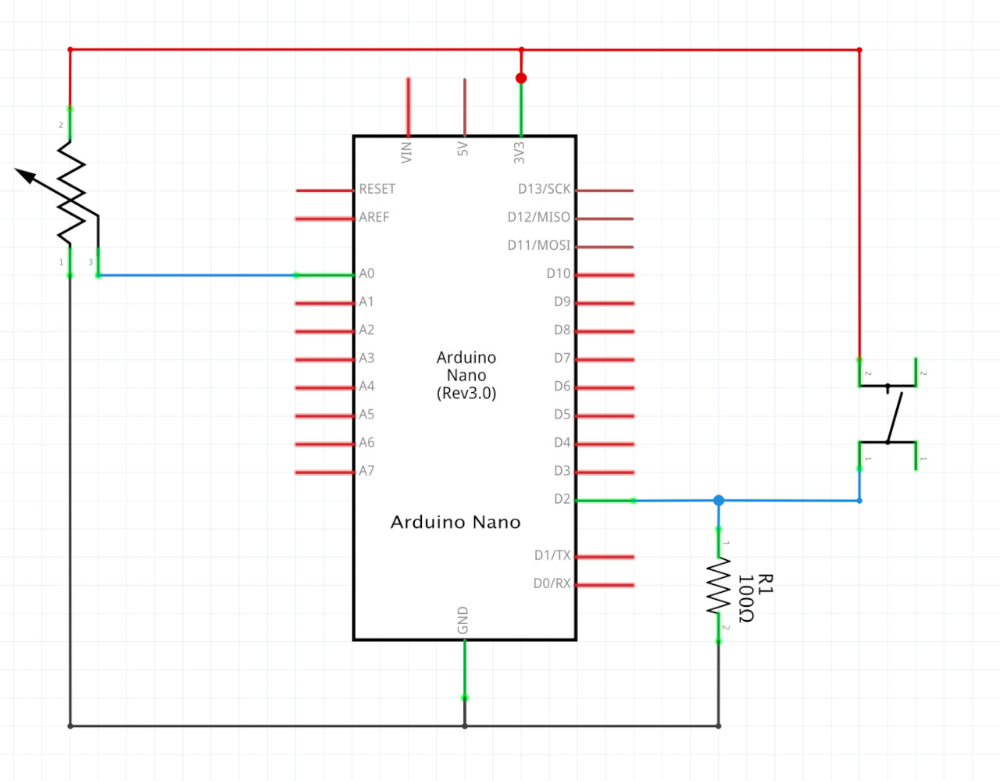
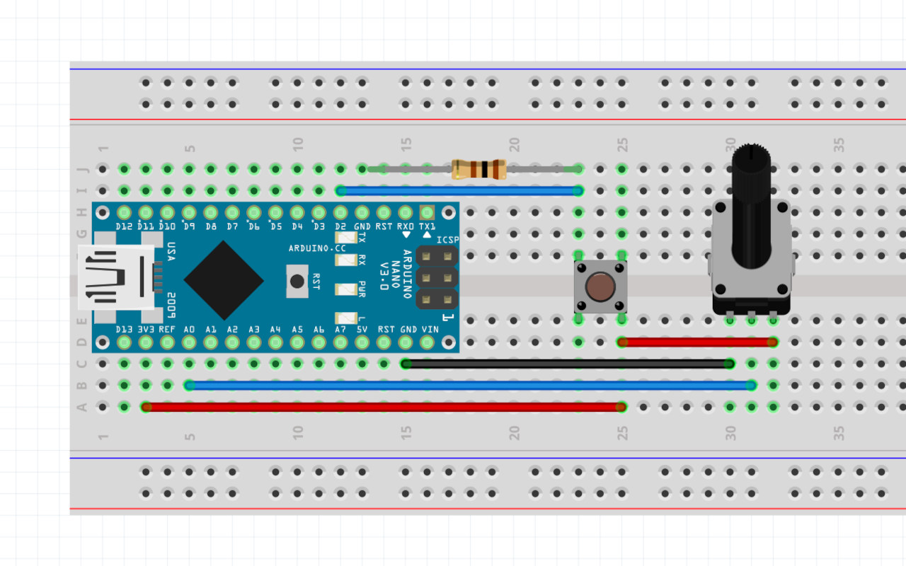

# Final Project Template using BLE communication

Arduino reads a button on pin 2 and a potentiometer on pin A0 and passes those values on to the p5js sketch via a BLE connection.

The object that is created and sent to p5js looks like this:

```
data = {
  A0: { value: integer },
  D2: {
    isPressed: boolean,
    count: integer
  }
}
```

In p5js ```A0.value``` is used to change ellipse diameters, ```D2.isPressed``` is used to increase a noise offset variable and ```D2.count``` is used to pick a shade of red.

## Schematic


## Board

